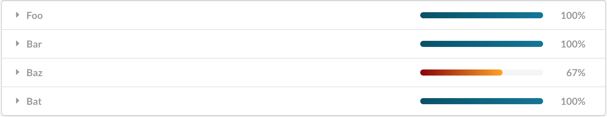
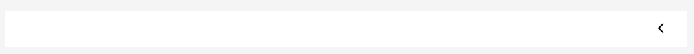
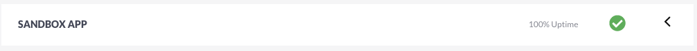
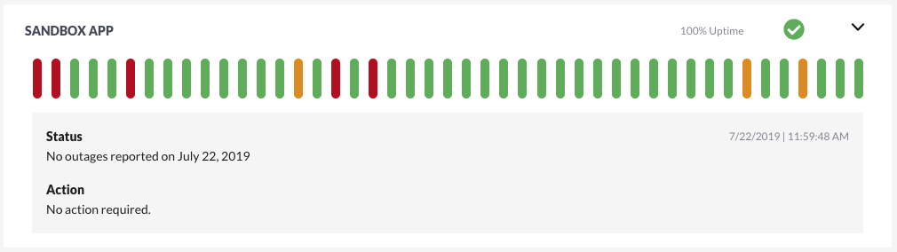

# The Case for Custom Components

Over the summer, I have been working on a web application for an internship. When we started the project, I assumed we'd be using some CSS framework, like Material or Semantic, so we could focus on adding functionality. And that's what we did. We initialized the project, and used Semantic-UI components like Buttons, Cards, Accordions, and more. After the first couple weeks, some folks on the project started talking about swapping out Semantic with custom components. My immediate thought was "Are you crazy?? Why would we get rid of perfectly good components and waste time replacing them?" But then I took a second look at some of the issues we were having.

## Pain Points with Framework Components

It wasn't long before we ran into some issues using framework components. We were using Semantic's Accordion component, but needed to change its style to match the rest of our application. This is what our component looked like: 



Overall, it's a pretty good looking component! However, our UX team needed me to make a couple tweaks to it, in order to provide a consistent experience across our other applications. For instance, the dropdown arrows should be on the right side of the accordion, and match the icons used in other applications. This kind of customization simply isn't possible with Semantic. 

This was the first sign of trouble, and the first lesson I learned: **If you rely upon a CSS framework, you are tied to it.**

It's totally understandable why Semantic *doesn't* let you change parts of components this way. Providing an interface for such fine-grained tweaking isn't in the scope of what Semantic offers. Semantic's primary purpose is to make it easy to have a consistent style across your appliation with as little effort as possible. That works perfectly for personal projects and for organizations that have decided to use Semantic for all their applications. In our use case, however, we needed to make specific components to match mockups provided by the UX team. Because of this, we were forced to swap out Semantic components with our own.

## Migration process

For many of the components, switching from Semantic to custom styles was super easy. For buttons, for instance, it was as simple as defining custom attributes on `button` tags.

```css
button {
  font-family: var(--font-family), sans-serif;
  font-weight: 700;
  font-size: 14px;
  line-height: 21px;
  color: white;
  border: none;

  background-color: #005f7c;
  box-shadow: 0 4px 20px rgba(0, 0, 0, .05);
  border-radius: 5px;

  padding: .75rem 1.5rem;
}
```

That works just fine for components that are simply custom styles on top of built-in HTML components. For more complex components with their own behaviors (i.e., the Accordion component), things weren't so simple.

## The Accordion Component

*The source code for my Accordion component can be found [here](https://github.com/derek-rogers/derek-rogers.github.io/tree/development/blog-posts/Posts/CustomComponents/src)*

The main custom component I wrote as a part of this transition was the Accordion. Where the Semantic Accordion was highly opinionated, I wanted my Accordion to have as few opinions about how it should look as possible. I decided the most resilient design would be one that simply provides the "open" and "close" behaviors, but allows users to specify their own visual components inside it.

The Accordion's usage is very similar to Semantic's:

```jsx
// Custom Accordion
<Accordion>
    <Accordion.Item>
        <Accordion.Title></Accordion.Title>
        <Accordion.Content></Accordion.Content>
    </Accordion.Item>
</Accordion>
```
The `Accordion` component represents one Accordion, which is a collection of `Accordion.Item` components. This allows the user to group related items together visually. The above empty component would simply render the following component:



The component still demonstrates the expected behavior, with its expanded state looking just slightly different:


Any component put inside the `Title` tag will be rendered in the title and any component put inside the `Content` tag will be rendered as the content shown when the Accordion expands. This allows the component to be completely un-opinionated in terms of what it renders. It also makes nested Accordions very straightforward, by simply putting another `Item` inside the `Content` component:

```javascript
// Custom Nested Accordion
<Accordion>
    <Accordion.Item>
        <Accordion.Title></Accordion.Title>
        <Accordion.Content>
            
            <Accordion.Item>
                <Accordion.Title></Accordion.Title>
                <Accordion.Content></Accordion.Content>
            </Accordion.Item>
        
        </Accordion.Content>
    </Accordion.Item>
</Accordion>
```

One distinction between my custom Accordion and Semantic's is that my custom component's behavior is completely self-contained. To use a Semantic accordion, you have to define your own method for expanding and collapsing Accordion items.

With my custom component (along with a couple other changes in requirements), our Accordions now look like this:




## Areas for Improvement

Because this was developed as just part of one story in one sprint, I didn't have the time to implement all the features I would have liked to.

As it stands now, the component still relies on a PNG file placed in the `public` directory to render the dropdown arrow:

```javascript
// snippet from Accordion.Title
return(<div className={style.AccordionTitle} onClick={this.handleClick}>
            {this.props.children || null}
            <div></div>
        </div>);
```

Ideally, this would be either built-in to the component, or passed as a prop so that it would be customizable.

## Lessons Learned

Initially, I was very wary of transitioning away from Semantic in favor of custom components. I was worried it would add unnecessary work without real upside. However, after making the transition, there are definitely benefits of freeing your application from frameworks:

1. By defining your own components you aren't tied to the opinions of your chosen framework. You're free to fine-tune 100% of your application

1. Reducing dependencies on external libraries is almost always safer, as you can be sure your own component implementations won't change without your doing so

1. It's a great learning experience. Implementing your own components gives you a deeper understanding of JavaScript, CSS, and web development in general.

There are certainly times where using CSS frameworks make sense. They're super quick to stand up and give your app an immediately clean and polished look. But if you want your web application to be truly unique and under your control, try making your own components!

Have you or your team made the switch from frameworks to custom components? I'd love to hear your thoughts on how it went!
